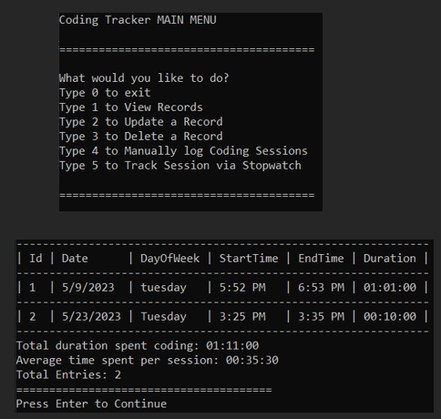

# Coding Tracker: 

#### This is a CRUD application developed using SQLite and C#. This application can be used to track coding sessions via stopwatch or manual input.

# Given Requirements:

* This application has the same requirements as the Habit Tracker project, except that now you'll be logging your daily coding time.
* To show the data on the console, you should use the "ConsoleTableExt" library.
* You're required to have separate classes in different files (ex. UserInput.cs, Validation.cs, CodingController.cs)
* You should tell the user the specific format you want the date and time to be logged and not allow any other format.
* You'll need to create a configuration file that you'll contain your database path and connection strings.
* You'll need to create a "CodingSession" class in a separate file. It will contain the properties of your coding session: Id, StartTime, EndTime, Duration
* The user shouldn't input the duration of the session. It should be calculated based on the Start and End times, in a separate "CalculateDuration" method.
* The user shouldn't input the duration of the session. It should be calculated based on the Start and End times, in a separate "CalculateDuration" method.
* When reading from the database, you can't use an anonymous object, you must read your table into a List of Coding Sessions.
* Add the possibility of tracking the coding time via a stopwatch so the user can track the session as it happens.
* Let the users filter their coding records per period (days, month, years) and/or order ascending or descending.
* Create reports where the users can see their total and average coding session per period.

